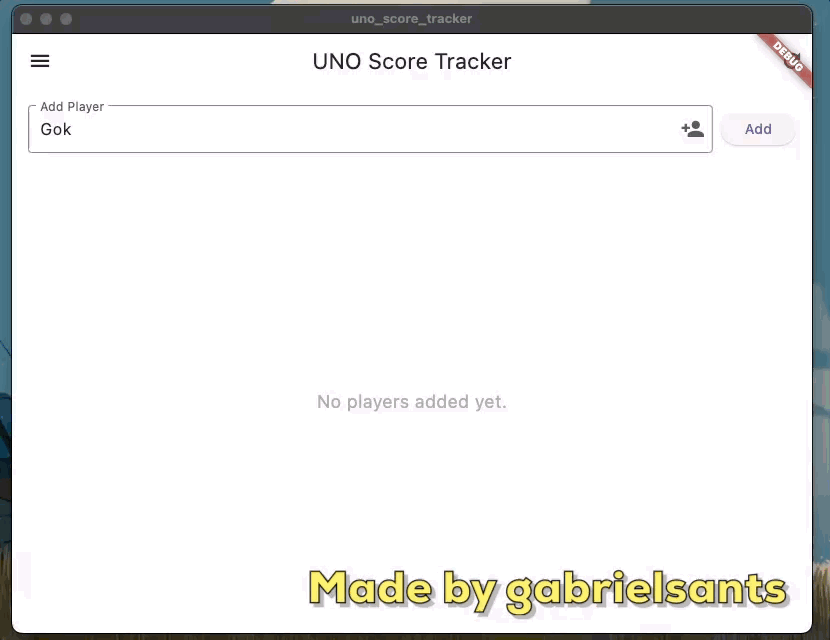
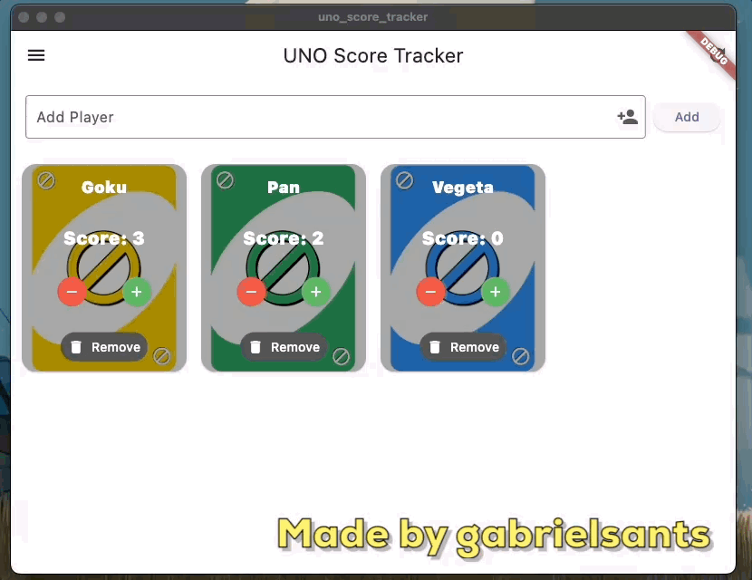

# Uno Score Tracker

Uno Score Tracker is a Flutter application developed to manage player scores during Uno games.

## Features
- **Track multiple players' scores:** Add up to ten players and track their scores in real-time.
- **Adaptive interface:** See the interface adapt as the game score changes.
- **Simple and intuitive interface:** Easy to use, with clear controls to add players and adjust scores.
- **Customizable settings:** Options to reset points when removing or adding new players.

### Add Players and Update Scores


### Settings: Reset Scores when removing a player and/or adding a new one


## Technologies Used
- Flutter
- Dart

## How to Run the Project

1. Clone this repository:
```bash
git clone https://github.com/gabrielsants/uno_score_tracker.git
```
2. Navigate to the project folder:
```bash
cd uno_score_tracker
```
3. Install dependencies:
```bash 
flutter pub get
```
4. Run the application:
```bash 
flutter run
```

## Contributors

<a href="https://github.com/gabrielsants/uno_score_tracker/graphs/contributors">
  
</a>
